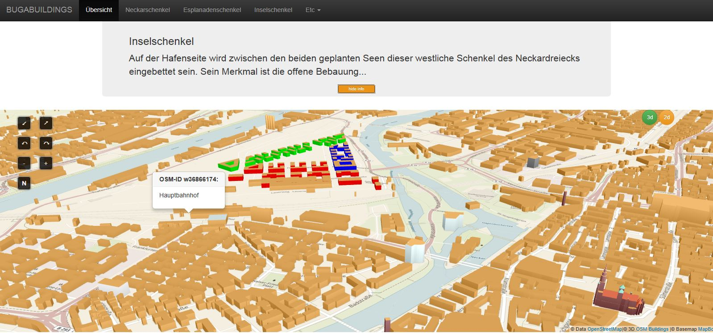

# ERVOLKT.github.io

This is a webdev playground for the visualisation of the BUGA HN. It is mainly based on [OSMBuildings](http://www.osmbuildings.org) code

#Interaction
-Press Ctrl + Alt + drag the Mouse w/ a leftclick to move around the 3D scene

-Use pinch, rotate, press and tap gestures on mobile devices to move around

-Control the 2d scene as usual

-Use 

#To-Do:

-Adapt to reality: include planned lakes / orchards etc. as .OBJ files, instead of only buildings

-Timeline function: Switch from one point in time to another during the BUGA concept

-Supply popover info for planned buildings as well

-Get Popups and control buttons running on mobile ...

-Show fully functional 2d-application, incl. tabbing, if browser has no support for webgl..

-Recycle 2d and 3d geojson files requested from osmbuildings-server

-Include interaction info, e.g. BS modal, Glyphicons etc.

-Show loading info

-Simplify Code

-Highlight buildings in 2d-map

-Debug Glmap Popovers